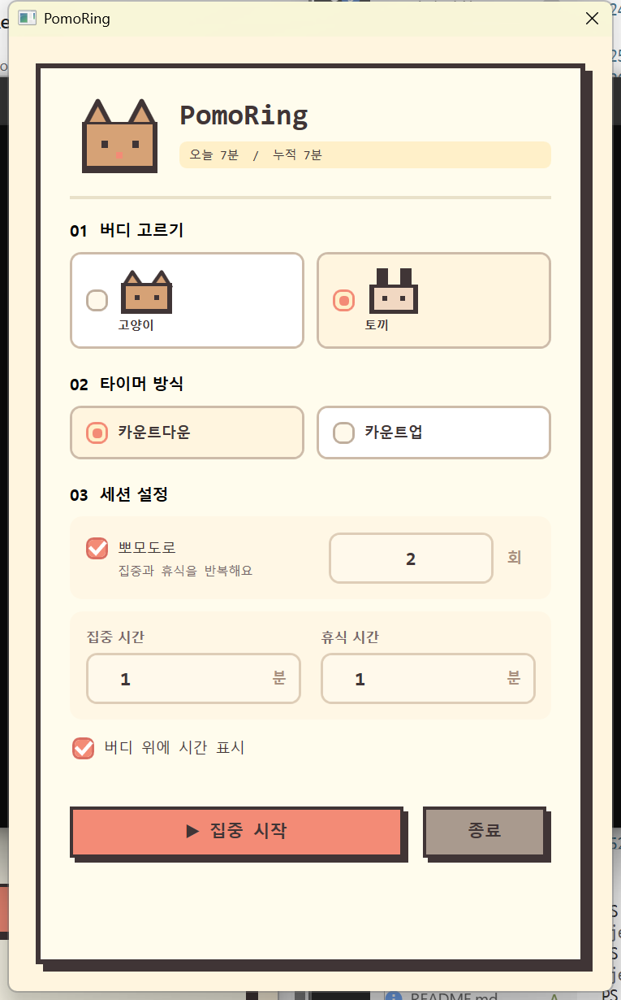

# PomoRing

화면 한쪽에서 귀여운 픽셀 버디와 함께 집중하는 Windows 뽀모도로 타이머입니다.

고양이 또는 토끼 버디를 선택하고 집중을 시작해 보세요. 집중 시간에는 버디가 책상 앞에서 함께 공부하고, 휴식 시간에는 이불을 덮고 잠시 쉬어 갑니다.

## 주요 기능

- 집중과 휴식을 반복하는 뽀모도로 모드
- 휴식 없이 한 번만 진행하는 집중 모드
- `00:00`부터 제한 없이 측정하는 카운트업
- 항상 화면 위에 표시되는 픽셀 버디
- 고양이와 토끼 버디 선택
- 버디 드래그 이동
- 버디 더블클릭으로 설정창 열기
- 우클릭 메뉴를 통한 일시정지, 재개, 설정 열기, 종료
- 세션 완료 알림 및 설정창 자동 열기
- 오늘 및 누적 집중 시간 저장
- 누적 집중 시간에 따른 버디 성장

## 스크린샷



집중 버디와 휴식 버디 스크린샷은 추후 추가할 예정입니다.

## 요구 사항

- Windows 10 이상
- .NET 10 SDK

설치된 .NET 버전 확인:

```powershell
dotnet --version
```

## 실행

저장소 루트에서 다음 명령어를 실행합니다.

```powershell
dotnet run --project .\PomoRing\PomoRing.csproj
```

## 빌드

디버그 빌드:

```powershell
dotnet build .\PomoRing\PomoRing.csproj
```

빌드된 실행 파일:

```text
PomoRing\bin\Debug\net10.0-windows\PomoRing.exe
```

## 배포용 빌드

.NET 런타임이 설치된 Windows용:

```powershell
dotnet publish .\PomoRing\PomoRing.csproj -c Release -r win-x64 --self-contained false
```

.NET 설치 없이 실행 가능한 단일 파일:

```powershell
dotnet publish .\PomoRing\PomoRing.csproj -c Release -r win-x64 --self-contained true -p:PublishSingleFile=true
```

배포 결과는 다음 경로에 생성됩니다.

```text
PomoRing\bin\Release\net10.0-windows\win-x64\publish\
```

## 사용 방법

1. 고양이 또는 토끼 버디를 선택합니다.
2. 카운트다운 또는 카운트업을 선택합니다.
3. 카운트다운에서는 집중 시간과 뽀모도로 반복 여부를 설정합니다.
4. `집중 시작`을 누르면 설정창이 숨겨지고 플로팅 버디가 나타납니다.
5. 버디를 드래그해 원하는 위치로 이동합니다.
6. 버디를 더블클릭하면 타이머를 멈추고 설정창으로 돌아갑니다.

## 데이터 저장

설정과 집중 기록은 다음 파일에 저장됩니다.

```text
%AppData%\PomoRing\settings.json
```

## 기술 스택

- C#
- WPF
- .NET 10
- JSON 기반 로컬 설정 저장

## 프로젝트 구조

```text
PomoRing/
  Models/       설정 및 사용자 기록 모델
  Services/     타이머와 설정 저장 로직
  MainWindow.*  설정 화면
  BuddyWindow.* 플로팅 픽셀 버디
```
